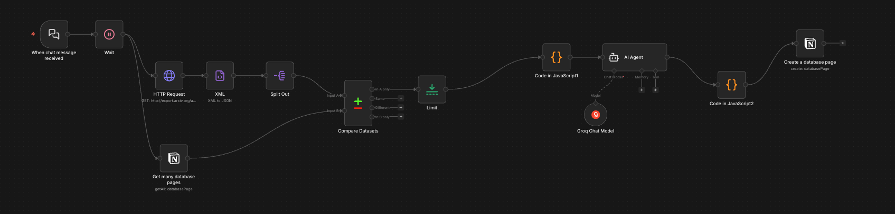

#  PaperScout

An AI powered n8n workflow that helps computer science students discover, understand, and organize research papers from arXiv.

PaperScout automatically fetches research papers, extracts key insights using an AI model, and stores the results in a structured Notion database for easy browsing and future reference.

#  Features

-  Fetches the latest research papers from arXiv based on user-defined topics.
-  Uses an AI model(Llama 3.1 8B) to summarize papers and extract key technical insights.
-  Generates beginner friendly project ideas inspired by each paper.
-  Stores organized paper information in a Notion database.
-  Built as a no-code/low-code automation using n8n.

#  How it works

###  1. Search for Papers
The user provides a research topic, which is used to query the **arXiv API** for the latest publications.

###  2. Respect API Limits
To comply with arXiv's request policy, PaperScout automatically introduces a delay between API calls, preventing request throttling.

###  3. Parse & Process
The XML response is converted into JSON, and each research paper is extracted as an individual record for further processing.

###  4. Remove Duplicates
Each fetched paper is compared against the existing Notion database. Papers that have already been processed are discarded, ensuring only **new research** is analyzed.

###  5. Prioritize Fresh Papers
From the remaining papers, the first **two unseen papers** are selected to minimize unnecessary LLM usage while keeping recommendations current.

###  6. Clean the Metadata
A JavaScript preprocessing step extracts and formats the relevant metadata before passing it to the AI agent.

###  7. Generate Insights
The AI agent analyzes each paper and produces:
- A concise problem & solution overview
- A notable technical takeaway
- A beginner-friendly PyTorch project idea

###  8. Organize Everything
The AI response is transformed into structured fields and automatically stored in a **Notion database**, creating a searchable repository of research papers.

# Workflow

  

#  Tech Stack

| Category | Technologies |
|----------|--------------|
| Workflow Automation | n8n |
| Research Source | arXiv API |
| LLM | Meta Llama 3.1 8B |
| Database | Notion |
| Data Processing | JavaScript |
| Data Format | XML → JSON |

#  Future Improvements

- 💬 **Conversational Research Assistant** – Integrate an AI chatbot capable of searching the entire Notion knowledge base, answering questions about stored papers, and providing deeper explanations of research concepts.

-  **In-Depth Paper Discussions** – Enable interactive conversations where users can explore a paper's methodology, architecture, results, and potential limitations beyond the generated summary.

-  **Related Paper Recommendations** – Suggest similar or prerequisite papers based on the user's interests and previously stored research.

-  **Research Analytics Dashboard** – Visualize trends such as popular research domains, publication frequency, and emerging topics.

-  **Personalized Learning Paths** – Generate curated reading lists and project roadmaps tailored to the user's interests and skill level.
